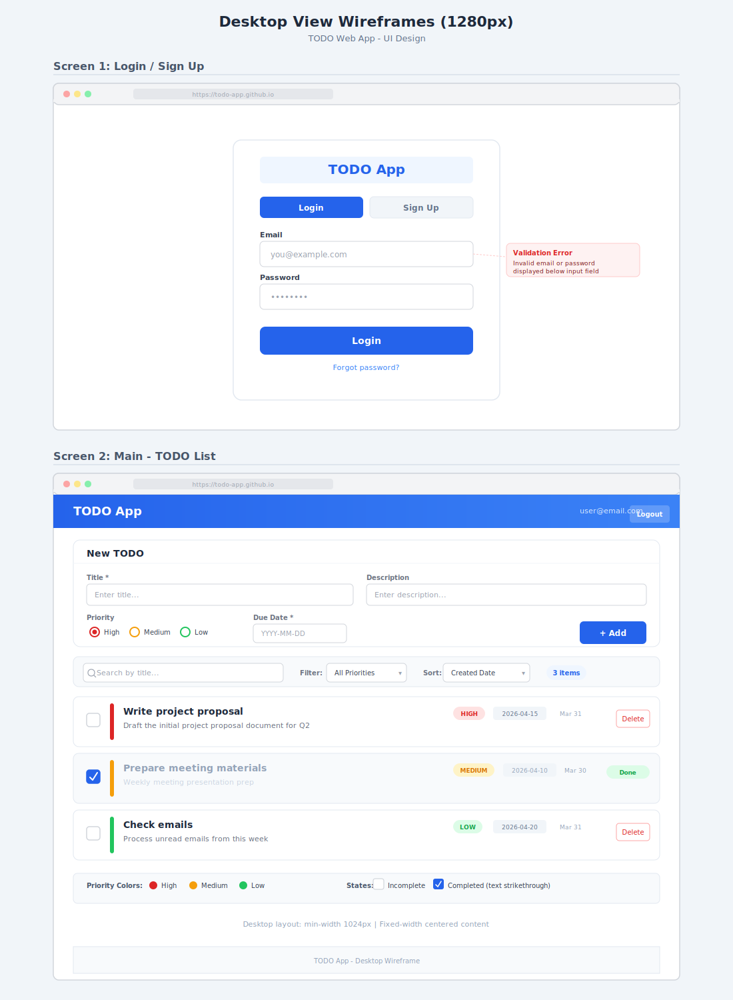
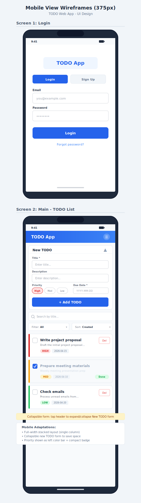

# 프론트엔드 설계

## UI 라이브러리 — Mantine v7

| 패키지 | 용도 |
|--------|------|
| `@mantine/core` | 기본 UI 컴포넌트 (Button, TextInput, Checkbox, Badge, Card, Select 등) |
| `@mantine/hooks` | 유틸리티 훅 (useDisclosure, useLocalStorage 등) |
| `@mantine/dates` | 마감일 입력용 DatePickerInput |
| `@mantine/notifications` | TODO 생성/삭제 시 알림 토스트 |
| `@mantine/form` | 폼 유효성 검사 (TodoForm) |

### 주요 컴포넌트 매핑

| 화면 요소 | Mantine 컴포넌트 |
|-----------|-----------------|
| TODO 입력 폼 | `Paper`, `Collapse`, `TextInput`, `Textarea`, `Select`, `DatePickerInput`, `Button` |
| TODO 항목 | `Card`, `Checkbox`, `Badge`, `ActionIcon`, `Group`, `Text` |
| TODO 리스트 | `Stack` |
| 검색 바 | `TextInput` (leftSection에 검색 아이콘) |
| 필터/정렬 | `Select`, `Group`, `Badge` (건수) |
| 헤더 | `AppShell.Header`, `Group`, `Title`, `Button`, `Menu` |
| 우선순위 뱃지 | `Badge` (color: red/yellow/blue) |
| 알림 | `notifications.show()` |
| 레이아웃 | `AppShell`, `Container` |

### 반응형 디자인

- Mantine의 `visibleFrom` / `hiddenFrom` props로 데스크톱/모바일 요소 분기
- breakpoint 객체 `{ base, sm, md }` 활용
- Header: 데스크톱 텍스트 메뉴 / 모바일 드롭다운 메뉴
- TodoForm: Collapse 접기/펼치기 (모바일 화면 공간 절약)

---

## 상태 관리

```
┌─────────────────────────────────────────┐
│     TodoContext (Context + useReducer)   │
│   - TODO 목록                           │
│   - CRUD 액션 (addTodo, deleteTodo,     │
│     toggleTodo)                         │
│   - StorageService를 통한 persist       │
└─────────────────────────────────────────┘
```

- **TODO 데이터**: React Context + useReducer로 관리
- **데이터 저장**: StorageService 인터페이스로 추상화 (현재 LocalStorageService)
- **개발 초기**: 로컬 스토리지만으로 동작 → 백엔드 완성 후 API 연결
- **인증 불필요**: Cognito Identity Pool이 자동으로 비인증 사용자를 식별

---

## 화면 구성

### Desktop View (1280px)



- 메인 화면: 헤더(앱 이름) → 입력 폼(접기/펼치기) → 검색/필터 바 → TODO 리스트
- TODO 항목: 체크박스 + 좌측 우선순위 컬러바 + 제목/설명 + 우선순위 뱃지 + 마감일 + 삭제 버튼
- 완료 항목: 텍스트 strikethrough + 회색 처리

### Mobile View (375px)



- 단일 컬럼 스택 레이아웃
- New TODO 폼: 접기/펼치기 가능 (화면 공간 절약)
- 우선순위: 좌측 컬러 바 + 컴팩트 뱃지
- 필터/정렬: 가로 2분할 드롭다운
- 삭제 버튼: 축약 표시 (Del)

---

## 컴포넌트 트리

```
App (MantineProvider + Notifications + TodoProvider)
└── AppShell
    ├── AppShell.Header
    │   └── Header     — Group, Title, Menu (반응형: visibleFrom/hiddenFrom)
    └── AppShell.Main
        └── Container
            ├── TodoForm    — Paper, Collapse, TextInput, Textarea, Select, DatePickerInput, Button
            ├── TodoSearch  — TextInput (leftSection: 검색 아이콘)
            ├── TodoFilter  — Group(grow), Select × 2, Badge (건수)
            ├── TodoList    — Stack
            │   └── TodoItem — Card (좌측 컬러바), Checkbox, Badge, ActionIcon
            └── Footer
```
